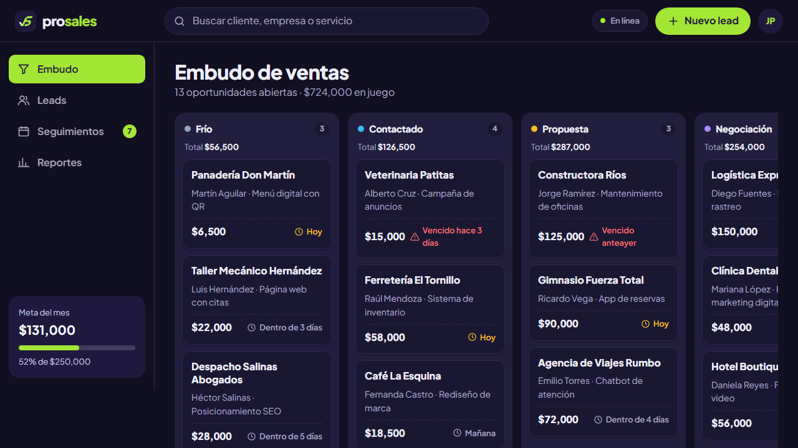
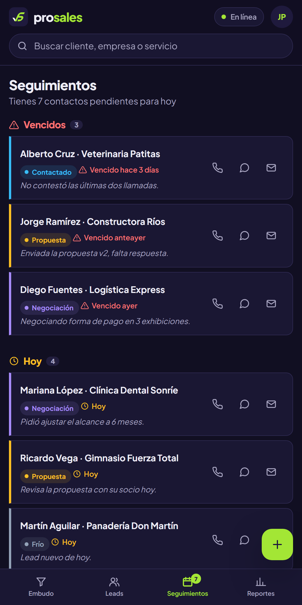

# Ejercicio 2 · Maquetado del App Shell y Splash Screen nativa

Segunda capa de Prosales: la **interfaz base** de la aplicación siguiendo la arquitectura
**App Shell**. El "cascarón" (header, menú de navegación y contenedor principal) vive en el
HTML y se pinta al instante; el **contenido dinámico** (los leads) se carga después desde
`data/leads.json` y se inyecta dentro del contenedor.

<p align="center">
  
  
</p>

## Objetivos

- [x] Diseño responsivo de la interfaz base: **header**, **menú de navegación** y **contenedor principal**.
- [x] Separación entre la estructura estática (shell) y el contenido dinámico.
- [x] Verificación de la **Splash Screen nativa** con Chrome DevTools al simular la instalación.

## Arquitectura del App Shell

```
┌──────────────────────────────────────────────────────────┐
│ HEADER   logo · búsqueda · estado de red · nuevo · perfil │  ← estático (index.html)
├──────────────┬───────────────────────────────────────────┤
│ MENÚ         │ CONTENEDOR PRINCIPAL  <main>              │
│ · Embudo     │                                           │
│ · Leads      │   contenido dinámico generado por         │  ← dinámico (app.js +
│ · Seguim.    │   app.js a partir de data/leads.json      │     data/leads.json)
│ · Reportes   │                                           │
│ [meta]       │                                           │
└──────────────┴───────────────────────────────────────────┘
```

| Pieza | Dónde vive | Qué hace |
|---|---|---|
| Header | `index.html` → `.app-header` | Marca, búsqueda global, estado de conexión, botón "Nuevo lead" y perfil |
| Menú | `index.html` → `.app-nav` | Navegación entre vistas con `#hash` (el botón *atrás* funciona) |
| Contenedor | `index.html` → `<main>` | Marcos vacíos (`<section>`) que `app.js` llena con la vista activa |
| Contenido | `data/leads.json` + `js/app.js` | Leads, etapas, seguimientos y métricas |

### Responsivo

| Ancho | Menú | Header |
|---|---|---|
| > 860 px | Barra lateral fija con la meta del mes | Una fila: logo · búsqueda · acciones |
| ≤ 860 px | **Barra inferior** al alcance del pulgar + botón flotante "+" | Dos filas: la búsqueda baja a ancho completo |

En móvil, el tablero del embudo se desliza horizontalmente columna por columna (`scroll-snap`)
y los diálogos se convierten en hojas que suben desde abajo.

## Funcionalidades

- **Embudo (kanban):** seis etapas (Frío → Contactado → Propuesta → Negociación → Ganado / Perdido) con conteo y monto total por columna.
- **Leads:** búsqueda sin acentos ni mayúsculas, filtros por etapa y accesos directos para **llamar**, abrir **WhatsApp** con un mensaje prellenado o enviar **correo**.
- **Seguimientos:** agrupados en vencidos, hoy y próximos 7 días; el menú muestra un contador de pendientes.
- **Reportes:** ventas cerradas contra la meta, embudo abierto, tasa de cierre, ticket promedio, valor por etapa y origen de los leads.
- **Detalle y alta de leads** en diálogos nativos (`<dialog>`), con validación junto a cada campo.

> En este ejercicio los cambios (nuevo lead, cambio de etapa) viven en memoria y se pierden al
> recargar. La persistencia sin conexión se agrega en los siguientes ejercicios.

### Extras

- `shortcuts` en el manifest: al dejar presionado el ícono instalado aparecen **"Nuevo lead"** y **"Seguimientos de hoy"**.
- `screenshots` en el manifest (escritorio y móvil): Chrome muestra un **instalador enriquecido** con vista previa, como el de una tienda de apps.
- Datos de demostración con **fechas relativas**: la demo siempre tiene seguimientos "de hoy" sin importar cuándo se abra.
- Accesibilidad: navegación con teclado, `aria-current` en el menú, enlace "Saltar al contenido", foco visible, etapas que nunca dependen solo del color (texto + ícono) y respeto a `prefers-reduced-motion`.
- Modo oscuro automático.

## Splash Screen nativa

La Splash Screen **no se programa**: Chrome la genera al abrir la app instalada usando tres
datos del `manifest.json`:

| Propiedad | Valor | Papel en la Splash Screen |
|---|---|---|
| `background_color` | `#1F1A3D` | Color de fondo de toda la pantalla |
| `icons` | `icon-512.png` | Ícono centrado (Chrome elige el más cercano a 512 px) |
| `name` | `Prosales CRM` | Texto debajo del ícono |

El fondo es el mismo color Tinta del ícono, así que la transición Splash → App se ve continua.

### Cómo verificarla con Chrome DevTools

1. Inicia Apache y abre `http://localhost/prosales/ejercicio-2-app-shell/`.
2. **F12 → Application → Manifest.** Revisa que:
   - *Identity* muestre `name` y `short_name`.
   - *Presentation* muestre `display: standalone`, `theme_color` y `background_color`.
   - *Icons* incluya el de 512 px (el que usa la Splash Screen).
   - *Screenshots* y *Shortcuts* aparezcan con sus imágenes.
   - *Installability* no muestre errores.
3. Instala la app con el ícono **Instalar** de la barra de direcciones (o el botón ⊕).
4. Abre **Prosales** desde el escritorio o el menú Inicio: durante la carga aparece la Splash
   Screen con fondo Tinta, el ícono y el nombre.
5. Para verla como en un celular: **F12 → Toggle device toolbar (Ctrl + Shift + M)**, elige un
   dispositivo Android y recarga; o conecta un Android por USB y usa `chrome://inspect`.

> Tip: si la carga es muy rápida y la Splash Screen apenas se ve, en DevTools → **Network**
> activa *Slow 4G* antes de abrir la app.

## Estructura

```
ejercicio-2-app-shell/
├── index.html          ← App Shell: header, menú y contenedor
├── manifest.json       ← + shortcuts y screenshots
├── css/styles.css      ← tokens, layout con Grid y reglas responsivas
├── js/app.js           ← router, carga de datos y render de cada vista
├── data/leads.json     ← contenido dinámico (18 leads de demostración)
├── icons/              ← mismos íconos del ejercicio 1
└── screenshots/        ← capturas para el instalador enriquecido
```

## Capturas de verificación

> Agrega aquí tus capturas de DevTools (Application → Manifest) y de la Splash Screen.
